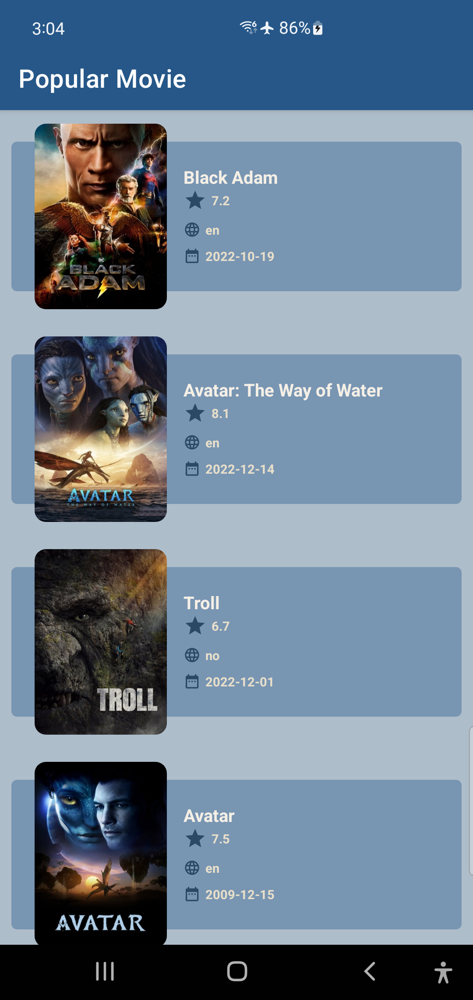
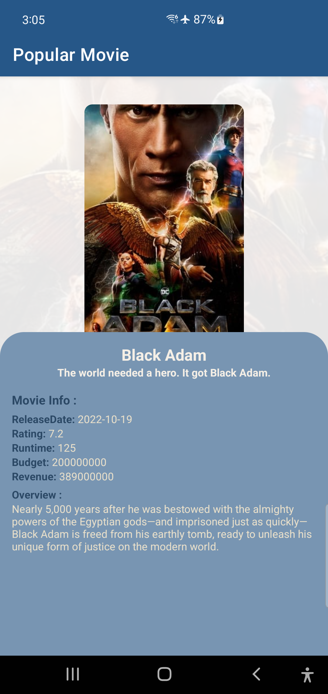

# Popular-Movie
Popular Movie Android App was written by Kotlin with libraries Dragger, Retrofit and follow the MVVM Architecture 

## Demo Screenshot
| Main Screen      | Details Screen      |
|------------|-------------|
|  |  | 
